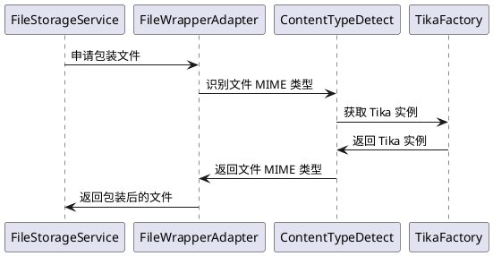

# 识别文件的 MIME 类型

默认是基于 `Tika` 来识别文件的 MIME 类型的，流程如下



## 自定义 Tika

如果默认的 `TikaFactory` 所创建的 `Tika` 对象满足不了你的需求，可通过以下方式自定义

这里用默认的 `DefaultTikaFactory` 来演示

**第一步：**

创建 `DefaultTikaFactory` 实现 `TikaFactory` 接口

```java
public class DefaultTikaFactory implements TikaFactory {
    private volatile Tika tika;

    @Override
    public Tika getTika() {
        if (tika == null) {
            synchronized (this) {
                if (tika == null) {
                    tika = new Tika();
                }
            }
        }
        return tika;
    }
}
```

**第二步：**

在 `SpringBoot` 中初始化 `DefaultTikaFactory` 即可 

```java
@Bean
public TikaFactory tikaFactory() {
    return new DefaultTikaFactory();
}
```


## 自定义 ContentType 识别

要是压根就不想用 `Tika` ，可以采用下面的方式自定义 `ContentTypeDetect`

这里用默认的 `TikaContentTypeDetect` 来演示

**第一步：**

创建 `TikaContentTypeDetect` 实现 `ContentTypeDetect` 接口

```java
@Getter
@Setter
@NoArgsConstructor
@AllArgsConstructor
public class TikaContentTypeDetect implements ContentTypeDetect {
    private TikaFactory tikaFactory;

    @Override
    public String detect(File file) throws IOException {
        return tikaFactory.getTika().detect(file);
    }

    @Override
    public String detect(byte[] bytes) {
        return tikaFactory.getTika().detect(bytes);
    }

    @Override
    public String detect(byte[] bytes,String filename) {
        return tikaFactory.getTika().detect(bytes,filename);
    }

    @Override
    public String detect(InputStream in,String filename) throws IOException {
        return tikaFactory.getTika().detect(in,filename);
    }
}
```

**第二步：**

在 `SpringBoot` 中初始化 `TikaContentTypeDetect` 即可

```java
@Bean
public ContentTypeDetect contentTypeDetect(TikaFactory tikaFactory) {
    return new TikaContentTypeDetect(tikaFactory);
}
```
